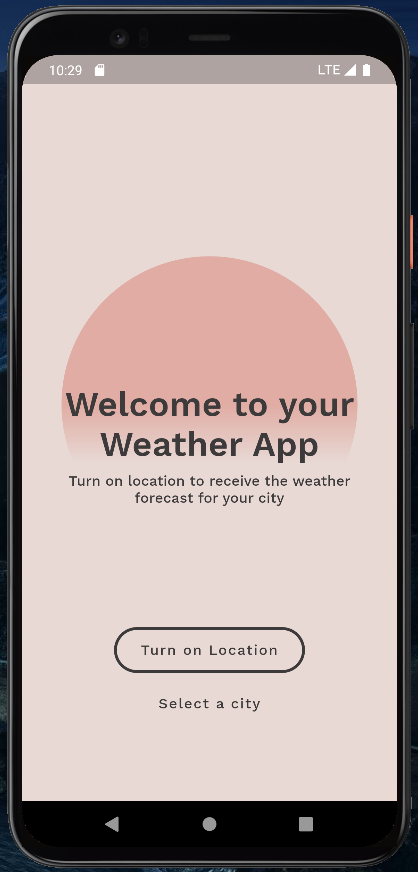
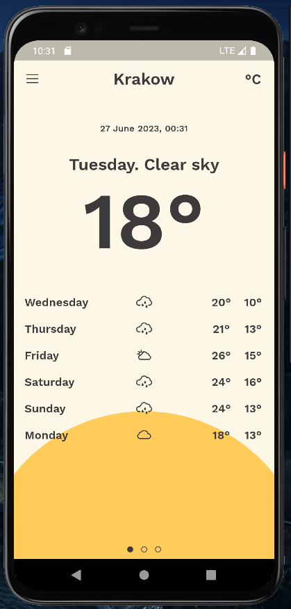
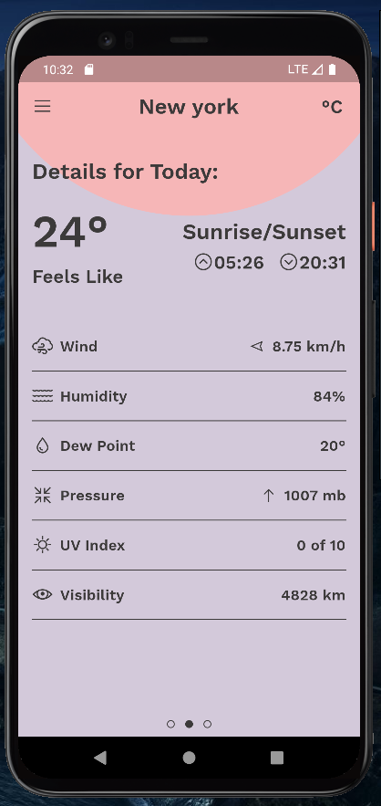

# My Weather App

My Weather App to jedna z moich starszych aplikacji, służy do sprawdzania pogody. Została wykonana samodzielnie przeze mnie, używając API OpenWeatherMap i inspirując się designem użytkownika dribble.com - [Sergey Gurov](https://dribbble.com/shots/3735400-Weather-App).

## Screenshots

|  |  |  |
|:---:|:---:|:---:|
|  |  |  |

## Features

- Podgląd aktualnej, szczegółowej i godzinowej pogody
- Zamiana jednostek Celsjusza i Fahrenheita
- Możliwość zlokalizowania miejscowości użytkownika do ustalenia pogody
- Wyszukiwarka miejscowości z zakładką "Ostatnio wyszukiwane" oraz możliwością dodawania lokacji do ulubionych
- Zapisywanie ostatnio przeglądanej miejscowości, ostatnich wyszukiwań i ulubionych

## Tech Stack (packages)

 - **Pobieranie danych z API** - [Http](https://pub.dev/packages/http)
 - **State managment** - [Flutter Bloc](https://pub.dev/packages/flutter_bloc)
 - **Zapisywanie danych lokalnie** - [Hive](https://pub.dev/packages/hive)
 - Equatable, Geolocator, Intl
 - Google Fonts, Line Awesome Icons, Flutter Painter
